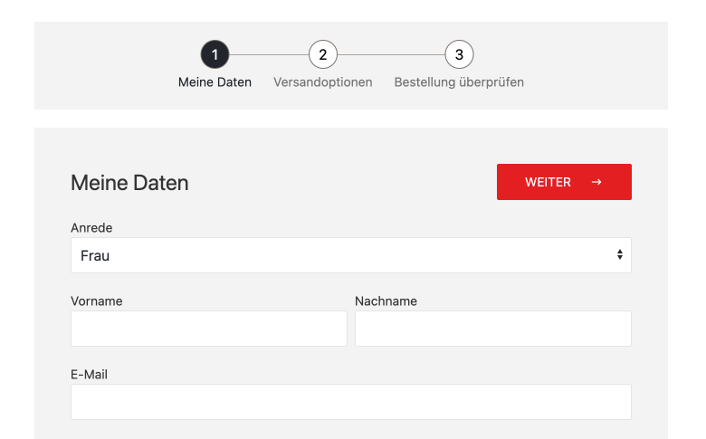

# MultiStepForm



Creating multi-step-forms with RockForms is straightforward.

First, you need to add the steps:

```php
$form = new MultiStepForm();
$form->addSteps([
  'foo' => [
    'headline' => 'The foo step',
  ],
  'bar' => [
    'headline' => 'The bar step',
  ],
]);

// optional: save reference for later use
wire()->mySteps = $form;
```

Every Step added will be a `RockForms\Step` object which will have a property `form` that is automatically populated with the form name that will be rendered. In our example the rendered forms would be `Foo` and `Bar` (with a capital first latter).

## Adding a prefix

```php
$form = new MultiStepForm();
$form->prefix = 'Checkout';
$form->addSteps([
  'contact' => [
    'headline' => 'Your Contact Data',
  ],
  'payment' => [
    'headline' => 'Select payment method',
  ],
]);
```

In this example the rendered forms would be `CheckoutContact` and `CheckoutPayment`.

## Going to the next step

Each step is in itself a RockForm, so each step has a `processInput()` and a `processSuccess()` method where you can put your very custom code, for example:

```php
public function processInput()
{
  $step = wire()->mySteps->get('name=foo');
  $step->save(['done' => false]);
}

public function processSuccess()
{
  $values = $this->values();
  wire()->mySteps->get('name=foo')
    ->save($values->getArray())
    ->save(['done' => true])
    ->toNext();
}
```
