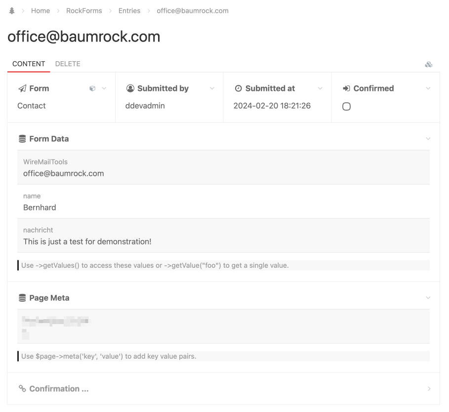

# Processing Form Submissions

Processing form submissions is done in the `processInput` method of your form. You can do whatever logic you need here.

## saveEntry

To save form submissions within your ProcessWire backend, you can utilize the `saveEntry` method, ensuring that all data is securely stored and easily accessible for further processing or analysis.

```php
public function processInput()
{
  // this is executed on every submit

  // all below is executed on submissions without errors
  if ($this->hasErrors()) return;

  // save entry do pw backend
  $values = $this->getValues();
  $this->saveEntry($values->mail); // use mail as title of page
}
```

The result is something like this:



### Confirmation Links

Please see docs about <a href="../double/">Double Opt In</a>.

## Sending Mails

Just use the awesome ProcessWire API to send mail notifications upon form submissions. Take this advanced example for inspiration:

```php
public function processInput()
{
  if ($this->isSpam) {
    wire()->modules->get('WireRequestBlocker')
      ->blocker()
      ->blockIp($_SERVER['REMOTE_ADDR'], [
        'url' => $this->wire->page->httpUrl(),
        'reason' => "Contactform Spam",
      ]);
  }
  if ($this->hasErrors()) return;

  $values = $this->getValuesWithoutHoney();
  $values->url = $this->wire->page->httpUrl();

  // save entry to backend
  $this->saveEntry($values->mail);

  // notify
  $mail = new WireMail();
  $mail->to('office@yourcompany.com');
  $mail->to('office@yourclient.com');
  $mail->from('robot@yourwebsite.com');
  $mail->subject("Contact-Form submission on yourwebsite.com");
  $mail->replyTo($values->mail);
  $mail->bodyHTML($this->renderTable($values));
  $mail->send();
}
```

This will send an (admittedly ugly) email to you and your client. If you also want to send a confirmation to your client you can make your emails look nicer with custom HTML. RockMails can help here ;)

## Throwing Errors

```php
public function processInput()
{
  // throw error on the form itself
  if($foo === 'bar') {
    $this->addError("Something is wrong");
    return;
  }

  // throw error on a single field aka component
  $values = $this->getValuesWithoutHoney();
  if ($values->surname === 'baz') {
    $this
      ->getComponent('surname')
      ->addError('--- name baz not allowed ---');
  }
}
```
